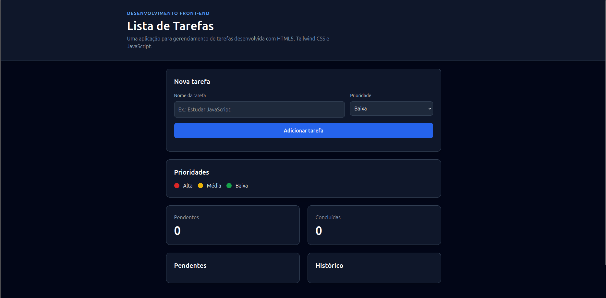
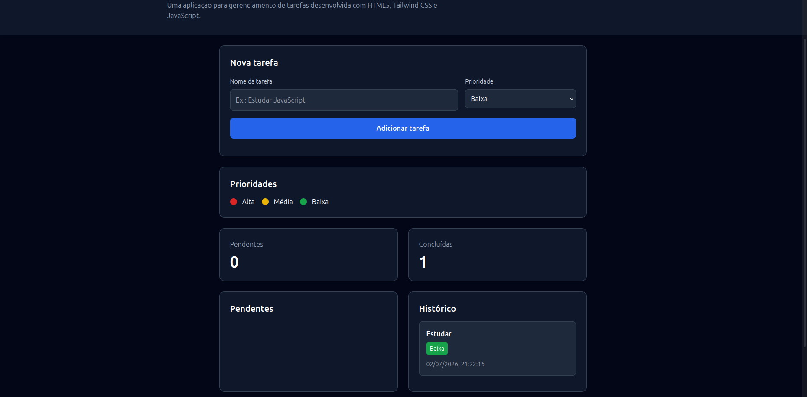

## Organização dos arquivos

O projeto foi organizado da seguinte maneira:

projeto/

├── index.html
├── js/
│   └── script.js
└── docs/
    └── documentacao.pdf

### Função de cada arquivo

index.html:
Responsável por toda a estrutura da interface da aplicação, contendo os elementos HTML, formulários, seções, contadores e integração com o JavaScript.

script.js:
Responsável por toda a lógica da aplicação. Realiza a manipulação do DOM, cadastro, conclusão e exclusão de tarefas, atualização dos contadores e gerenciamento do histórico.

documentacao.pdf
Arquivo contendo a documentação do projeto, explicando sua estrutura, funcionamento e os conceitos utilizados.

### Estrutura geral da aplicação

A aplicação é composta por:
• Cabeçalho
• Formulário para cadastro
• Legenda das prioridades
• Contadores
• Lista de tarefas pendentes
• Histórico de tarefas concluídas
• Rodapé

Todo o comportamento da aplicação é realizado utilizando JavaScript puro através da manipulação do DOM.

## Explicação dos métodos do DOM
document.getElementById()
• Esse método seleciona um elemento HTML através do seu atributo id.

document.querySelector()
• Seleciona o primeiro elemento que corresponda a um seletor CSS.

document.createElement()
• Cria um novo elemento HTML dinamicamente.

appendChild()
• Adiciona um elemento filho dentro de outro elemento.

classList.add()
• Adiciona uma classe CSS ao elemento.

classList.remove()
• Remove uma classe CSS.

addEventListener()
• Associa um evento a um elemento.

element.style
• Permite alterar estilos diretamente via JavaScript.

Aplicação dinâmica de classes do Tailwind
• As classes do Tailwind são adicionadas dinamicamente para indicar a prioridade.

element.remove()
• Remove um elemento do DOM.

Remoção de elementos do DOM
Ao excluir uma tarefa, ela é removida do vetor de tarefas pendentes e a lista é renderizada novamente, removendo automaticamente o elemento da tela.

Transferência de tarefas entre listas

Quando o usuário conclui uma tarefa:
• ela é removida da lista de pendentes;
• adicionada ao histórico;
• os contadores são atualizados automaticamente.

### Considerações finais

Durante o desenvolvimento deste projeto foi possível aplicar conceitos fundamentais de HTML5, Tailwind CSS e JavaScript.

O principal aprendizado foi compreender como realizar a manipulação do DOM utilizando JavaScript puro, criando elementos dinamicamente, respondendo a eventos do usuário e atualizando a interface sem recarregar a página.

As maiores dificuldades encontradas envolveram a organização do layout, a manipulação dinâmica das tarefas e a atualização correta dos contadores e do histórico. Esses desafios foram solucionados por meio da divisão do código em funções específicas e da utilização de métodos como createElement(), appendChild() e addEventListener().

O projeto permitiu consolidar conhecimentos sobre estruturação de páginas, responsividade, acessibilidade e boas práticas no desenvolvimento Front-End.